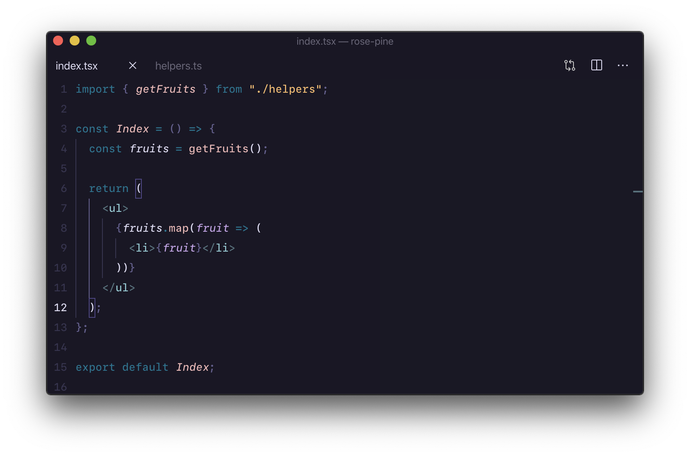

[](https://github.com/rose-pine/rose-pine-theme)

All natural pine, faux fur and a bit of soho vibes for the classy minimalist.



**Color customisations**

Rosé Pine hides the editor overview ruler (right gutter) and file explorer scrollbars - both of which cannot be hidden via preferences. If you would like to unhide these, modify your `settings.json`.

```json
{
  "workbench.colorCustomizations": {
    "[Rosé Pine]": {
      "editorOverviewRuler.addedForeground": "#9ccfd8ff",
      "editorOverviewRuler.border": "#0000",
      "editorOverviewRuler.bracketMatchForeground": "#706e86ff",
      "editorOverviewRuler.commonContentForeground": "#706e864d",
      "editorOverviewRuler.currentContentForeground": "#f6c17780",
      "editorOverviewRuler.deletedForeground": "#eb6f9280",
      "editorOverviewRuler.errorForeground": "#eb6f92ff",
      "editorOverviewRuler.findMatchForeground": "#706e864d",
      "editorOverviewRuler.incomingContentForeground": "#9ccfd880",
      "editorOverviewRuler.infoForeground": "#e0def4ff",
      "editorOverviewRuler.modifiedForeground": "#ebbcbaff",
      "editorOverviewRuler.rangeHighlightForeground": "#706e864d",
      "editorOverviewRuler.selectionHighlightForeground": "#706e864d",
      "editorOverviewRuler.warningForeground": "#f6c177ff",
      "editorOverviewRuler.wordHighlightForeground": "#706e864d",
      "editorOverviewRuler.wordHighlightStrongForeground": "#706e864d",

      "scrollbarSlider.activeBackground": "#706e8666",
      "scrollbarSlider.background": "#706e864d",
      "scrollbarSlider.hoverBackground": "#706e864d"
    }
  }
}
```
